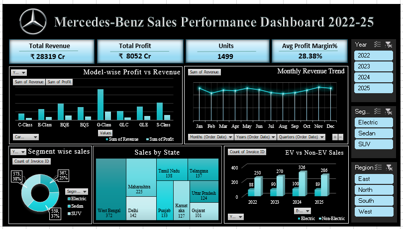

# 🚗 Mercedes-Benz Sales Performance Dashboard (2022–2025)

## 📌 Project Overview
This project presents an interactive **Sales Performance Dashboard** built in Microsoft Excel to analyze Mercedes-Benz sales data from 2022 to 2025.

The dashboard transforms raw sales data into meaningful business insights by tracking revenue, profit, sales volume, profit margin, model performance, regional distribution, and EV vs Non-EV trends.

It is designed to help management quickly evaluate performance and make data-driven business decisions.

---

## 📊 Dashboard Preview

---

## 🎯 Business Objectives
- Analyze total revenue and total profit
- Track unit sales performance
- Monitor average profit margin
- Compare EV vs Non-EV sales
- Identify top-performing car models
- Analyze state-wise and region-wise performance
- Track monthly revenue trends

---

## 🛠 Tools & Techniques Used
- Microsoft Excel
- Pivot Tables
- Pivot Charts
- Slicers (Year, Segment, Region)
- Conditional Formatting
- Data Cleaning & Structuring
- Excel Functions (SUM, COUNT, IF, AVERAGE, etc.)

---

## 📈 Key Performance Indicators (KPIs)
- 💰 Total Revenue: ₹ 28,319 Cr
- 💵 Total Profit: ₹ 8,052 Cr
- 🚘 Units Sold: 1499
- 📊 Average Profit Margin: 28.38%

---

## 📊 Dashboard Features

### 1️⃣ Model-wise Profit vs Revenue
Compares revenue and profit across different car models to identify high-performing models.

### 2️⃣ Monthly Revenue Trend
Tracks revenue growth from January to December to identify peak sales periods.

### 3️⃣ Segment-wise Sales Distribution
Breakdown of sales across:
- SUV
- Sedan
- Electric

### 4️⃣ State-wise Sales Performance
Highlights top-performing states like West Bengal, Maharashtra, and Tamil Nadu.

### 5️⃣ EV vs Non-EV Sales Comparison
Analyzes performance trends between electric and non-electric vehicles from 2022–2025.

### 6️⃣ Interactive Filters
Users can filter data dynamically using:
- Year
- Segment
- Region

---

## 📂 Dataset Details
The dataset includes the following columns:
- Invoice ID
- Order Date
- Year
- Month
- Car Model
- Segment
- Type (Electric / Non-Electric)
- Customer Type
- Sales Channel
- Finance Type & Provider
- Region
- State
- City
- Revenue
- Cost
- Profit
- Profit Margin %

This dataset is used for analytical and learning purposes.

---

## 🔍 Key Insights
- SUV segment contributes significantly to total revenue.
- Certain premium models generate higher profit margins.
- Some states consistently outperform others in revenue generation.
- EV sales show gradual growth across years.
- Revenue peaks during specific months indicating seasonal demand.

---

## 📈 Business Recommendations
- Increase marketing focus on high-profit SUV models.
- Promote EV vehicles in high-performing urban regions.
- Invest more in regions showing consistent growth.
- Analyze seasonal demand patterns for inventory planning.

---

## 🚀 How to Use
1. Download the Excel file from this repository.
2. Open in Microsoft Excel.
3. Enable editing if required.
4. Use slicers to filter and explore performance insights.

---

## 💡 Skills Demonstrated
- Data Cleaning & Preparation
- Business Performance Analysis
- Data Visualization
- Dashboard Design
- Analytical Thinking

---

## 👩‍💻 Author
Sakshi Kumbhar  
Aspiring Data Analyst  
Skilled in Excel, MySQL, Power BI, Tableau, and Python.

---

⭐ If you found this project useful, feel free to star the repository.
